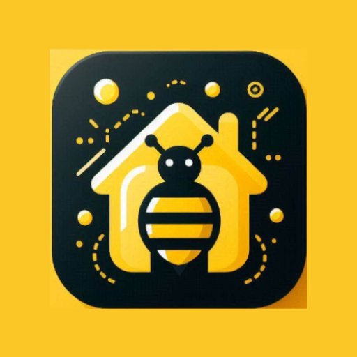

# HabitHive

HabitHive is a native Android habit tracking app for creating routines, scheduling recurring goals, and monitoring progress over time. It combines Firebase-backed user accounts with calendar-based tracking, habit categories, reminders, and charted progress views.



## Features

- Create habits with daily or monthly schedules.
- Track goals as checklists, counters, timers, or simple completion states.
- Organize habits by category, including health, study, work, finance, nutrition, social, meditation, running, and quit goals.
- View due habits by week and calendar date.
- Authenticate users with Firebase Auth.
- Store and sync habit data with Firebase Firestore.
- Visualize progress with MPAndroidChart.
- Schedule background work with Android WorkManager.

## Tech Stack

- Java
- Android Gradle Plugin
- Firebase Auth, Firestore, and Analytics
- Material Components for Android
- RecyclerView and ViewBinding
- Navigation components
- MPAndroidChart
- ThreeTenABP

## Project Structure

```text
app/src/main/java/com/darke/habithive/
  Creation.java              Habit creation flow
  Dashboard.java             Progress dashboard
  Habit.java                 Habit detail and tracking screen
  HabitAdapter.java          Habit list binding
  UserLoginFragment.java     Login flow
  UserSignupFragment.java    Registration flow
  WeekAdapter.java           Weekly calendar binding

app/src/main/res/
  layout/                    Activity, fragment, dialog, and card layouts
  drawable/                  Category icons and UI backgrounds
  mipmap-*/                  App launcher assets
  values/                    App strings, colors, dimensions, and themes
```

## Requirements

- Android Studio
- JDK 17 or the JDK bundled with Android Studio
- Android SDK with compile SDK 34
- Firebase project configured for the Android package `com.darke.habithive`

## Setup

1. Clone the repository.
2. Open the project in Android Studio.
3. Add the Firebase Android configuration file at:

   ```text
   app/google-services.json
   ```

4. Sync Gradle.
5. Build and run the `app` configuration on an emulator or Android device.

## Command-Line Build

From the repository root:

```powershell
.\gradlew.bat assembleDebug
```

Run local unit tests:

```powershell
.\gradlew.bat testDebugUnitTest
```

## Notes

- `local.properties`, `.gradle/`, IDE workspace files, and build outputs should remain untracked.
- Firebase service configuration is required for authentication and cloud sync to work.
- The local checkout may need Git repair if `git status` reports corrupt loose objects.
